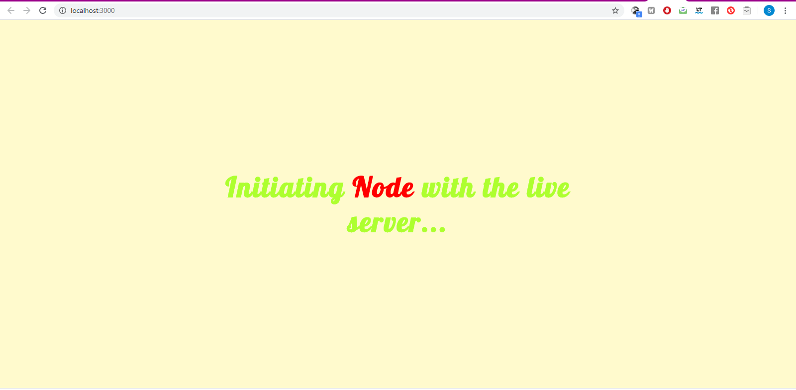

# Node live server

This is a starting project using the **lite-server** module of *node.js*.

After cloning the project, run:__

* ```npm install``` to install the node project dependencies.
* ```npm start``` to start the project.__ 
After running the 2nd command you should see your browser opening the index.html on
port *3000* just like the screenshot below__



Any changes in the project will be synchronised immediatly to be shown in the browser (after hit *save*)


